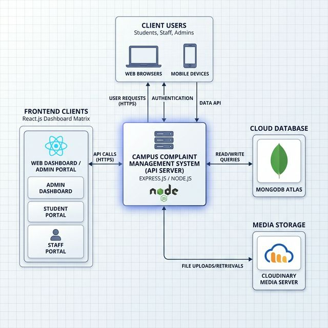
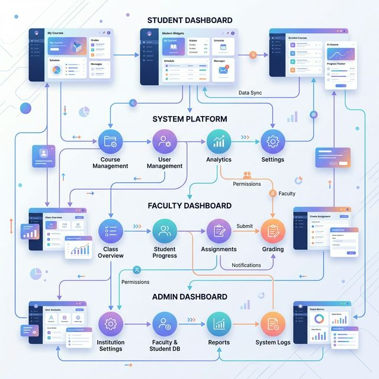
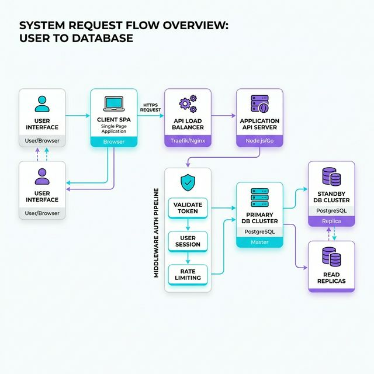
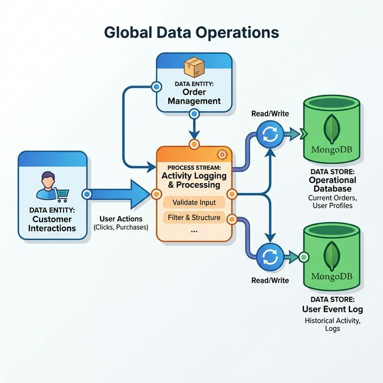
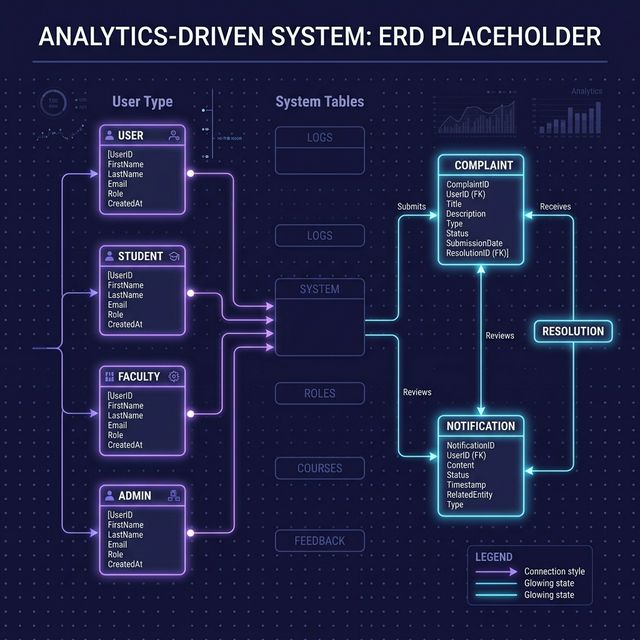

<h1 style="color:#0d6efd;">🌉 CampusBridge — Smart Campus Complaint & Lost-Found System</h1>

<p>
CampusBridge is a full-stack web application designed to digitize and streamline campus operations by connecting
students, faculty, and administrators on a unified platform. Built with <b>React</b> on the frontend and <b>Node.js</b> on the backend,
it enables <b>anonymous complaint submission</b>, <b>SLA-based issue resolution</b>, real-time tracking, and a 
<b>community-driven lost & found system</b>.
</p>

<p>
The platform ensures <b>transparency, accountability, and efficiency</b> in resolving campus issues while empowering students
to raise concerns without fear. It also enhances collaboration through centralized dashboards, notifications, and email updates.
</p>

<hr>

<h2 style="color:#6f42c1;">📑 Table of Contents</h2>

<ul>
<li>🔎 <a href="#what-is-campusbridge">What is CampusBridge</a></li>
<li>👥 <a href="#who-its-for">Who it's for</a></li>
<li>⚠️ <a href="#what-problems-it-solves">What problems it solves</a></li>
<li>✨ <a href="#features-by-module">Features by module</a></li>
<li>📂 <a href="#project-structure">Project structure</a></li>
<li>💻 <a href="#tech-stack">Tech stack</a></li>
<li>⚙️ <a href="#how-to-run-the-project-locally">How to run the project locally</a></li>
<li>🔑 <a href="#environment-variables">Environment variables</a></li>
<li>🌐 <a href="#all-api-routes-summary">All API routes (summary)</a></li>
<li>👥 <a href="#user-roles-and-permissions">User roles and permissions</a></li>
<li>🧠 <a href="#how-each-major-feature-works">How each major feature works</a></li>
<li>🚀 <a href="#deployment">Deployment</a></li>
<li>📦 <a href="#package-dependencies">Package dependencies</a></li>
<li>📜 <a href="#available-scripts">Available scripts</a></li>
<li>📬 <a href="#contact">Contact</a></li>
</ul>

<hr>


<h2 id="what-is-campusbridge" style="color:#198754;">🌉 What is CampusBridge</h2>

<p>
CampusBridge is a smart campus management platform designed to address everyday issues faced by students in educational institutions.
It creates a unified ecosystem where <b>students, faculty, and administrators</b> can interact seamlessly to resolve problems,
ensure accountability, and improve campus transparency.
</p>

<p>
The platform focuses on two major areas:
<b>Anonymous Complaint Management</b> and <b>Lost & Found System</b>, enabling a safe and efficient environment for students.
</p>

<p align="center">
  
</p>

<p><b>A student can use CampusBridge to:</b></p>

<ul>
<li>📝 Raise complaints anonymously without revealing identity</li>
<li>📊 Track complaint status in real-time (Pending → In Progress → Resolved → Delayed)</li>
<li>⏱️ Monitor SLA-based resolution timelines (24 hrs / 72 hrs / 7 days)</li>
<li>🔔 Receive instant notifications and email updates</li>
<li>📸 Upload image-based evidence for complaints</li>
<li>🔍 Track complaints using a unique Complaint ID</li>
<li>📦 Report found items through the Lost & Found system</li>
<li>📍 View and claim lost items across the campus</li>
<li>🤝 Contribute to a transparent and accountable campus ecosystem</li>
</ul>

<hr>

<h2 id="who-its-for" style="color:#fd7e14;">👥 Who It's For</h2>

<p align="center">
  
</p>

<table style="border-collapse: collapse; width:100%; text-align:left;">
<thead>
<tr style="background-color:#f8f9fa;">
<th style="border:1px solid #ddd; padding:10px;">Role</th>
<th style="border:1px solid #ddd; padding:10px;">What they use CampusBridge for</th>
</tr>
</thead>

<tbody>

<tr>
<td style="border:1px solid #ddd; padding:10px;">🎓 Student</td>
<td style="border:1px solid #ddd; padding:10px;">
Raise anonymous complaints, track issues, receive updates, and use lost & found system
</td>
</tr>

<tr>
<td style="border:1px solid #ddd; padding:10px;">👨‍🏫 Faculty</td>
<td style="border:1px solid #ddd; padding:10px;">
View complaints (without student identity), update status, ensure SLA-based resolution, manage lost items
</td>
</tr>

<tr>
<td style="border:1px solid #ddd; padding:10px;">🛠️ Admin</td>
<td style="border:1px solid #ddd; padding:10px;">
Monitor all activities, manage students & faculty, assign complaints, track system analytics, enforce accountability
</td>
</tr>

</tbody>
</table>

<hr>

<h2 id="what-problems-it-solves" style="color:#dc3545;">⚠️ What Problems It Solves</h2>

<ol style="line-height:1.8;">
<li>😨 Students hesitate to raise complaints due to fear → solved by <b>anonymous complaint system</b></li>
<li>📊 Lack of transparency in complaint handling → solved by <b>real-time tracking and status updates</b></li>
<li>⏳ Delayed issue resolution → solved by <b>SLA-based resolution system (24h / 72h / 7 days)</b></li>
<li>❌ No accountability from authorities → solved by <b>mandatory delay reasons and status logs</b></li>
<li>📬 No proper communication system → solved by <b>email + notification integration</b></li>
<li>🔍 Lost items rarely get returned → solved by <b>centralized Lost & Found system</b></li>
<li>📁 Manual complaint processes → solved by <b>digital and automated workflow system</b></li>
</ol>

<hr>

<h2 id="features-by-module" style="color:#6f42c1;">✨ Features by Module</h2>

<p align="center">
  
</p>

<h3 style="color:#0d6efd;">🎓 Module 1 — Student View</h3>
<ul>
<li>Anonymous signup and login via strictly verified OTP process</li>
<li>Submit complaints with up to 3 evidence images via Cloudinary</li>
<li>Receive real-time email notifications regarding complaint status</li>
<li>Report lost items or claim found items without revealing primary identity</li>
<li>Track history and SLA priority of raised complaints against faculty</li>
</ul>

<h3 style="color:#0d6efd;">👨‍🏫 Module 2 — Faculty View</h3>
<ul>
<li>View assigned complaints within departmental scope without seeing student identities</li>
<li>Update the operational status of complaints (In Progress, Resolved, Delayed)</li>
<li>SLA Compliance: Must provide a mandatory delay reason if a complaint breaches the timeline protocol</li>
<li>Post resolution remarks and track rating feedback from affected students</li>
</ul>

<h3 style="color:#0d6efd;">🛠️ Module 3 — Administrator View</h3>
<ul>
<li>Bird's-eye view of all students, faculty members, and live complaints</li>
<li>Override operational flow: manually assign or escalate a complaint to higher-tier faculty</li>
<li>Monitor overarching platform statistics via graphical Recharts visualizations</li>
<li>Investigate "Delayed" cases and manage structural data overrides</li>
</ul>

<p align="center">
  
</p>

<h3 style="color:#0d6efd;">📦 Module 4 — Complaint System Core</h3>
<ul>
<li>Chronological feed generation filtering pending versus answered grievances</li>
<li>Time-stamped audit trails tracking every single status manipulation</li>
<li>Automated mapping linking a <code>ComplaintId</code> to a hidden assigned <code>StudentId</code></li>
</ul>

<h3 style="color:#0d6efd;">🔍 Module 5 — Community Lost & Found</h3>
<ul>
<li>Centralized listing of all discovered or lost properties across campus bounds</li>
<li>Visual image uploads confirming the item's identity before meetup</li>
<li>"Returned" state transition enforced by uploading a <code>receiverPhoto</code> to prevent fraud</li>
</ul>

<hr>

<h2 style="color:#198754;">🗃️ Database Architecture (Entity Relationship)</h2>

<p align="center">
  
</p>

<ul>
<li><b>Student Model:</b> Stores institutional ID, hashed credentials, profile data, and OTP statuses.</li>
<li><b>Faculty Model:</b> Relates directly to assigned complaint arrays, storing department allocations.</li>
<li><b>Complaint Model:</b> Houses SLA timings, multi-tiered status flags, array of visual evidence URLs, and feedback hooks.</li>
<li><b>LostFound Model:</b> Maintains the state of ground discoveries, managing finder identity vs claimant return proofs.</li>
</ul>

## Project Structure
<pre>
CAMPUS-BRIDGE/
│
├── README.md                 ← This file
├── LICENSE                   ← Project license
│
├── BACKEND/
│   ├── .env
│   ├── .gitignore
│   ├── index.js
│   ├── initAdmin.js
│   ├── package.json
│   │
│   ├── config/
│   │   ├── db.js
│   │   ├── nodemailer.js
│   │   └── cloudinary.js  
│   │
│   ├── middleware/
│   │   ├── adminAuth.js
│   │   ├── auth.js
│   │   └── upload.js  
│   │
│   ├── controllers/
│   │   ├── adminController.js
│   │   ├── complaintController.js
│   │   ├── lostAndFoundController.js
│   │   ├── facultyController.js
│   │   ├── studentController.js
│   │
│   ├── models/    
│   │   ├── Student.js
│   │   ├── Admin.js
│   │   ├── Complaint.js
│   │   ├── LostFound.js
│   │   ├── Faculty.js
│   │   ├── Notification.js
│   ├── routes/
│   │   ├── adminRoutes.js
│   │   ├── complaintRoutes.js
│   │   ├── lostFoundRoutes.js
│   │   ├── facultyRoutes.js
│   │   ├── studentRoutes.js
│   │
│   └── utils/             
│       ├── emailTemplates.js
│       ├── generateOTP.js
│
└── FRONTEND/
    ├── .env 
    ├── .gitignore
    ├── netlify.toml  
    ├── vite.config.js
    ├── package.json
    ├── index.html
    │
    └── src/
        ├── main.jsx  
        ├── App.jsx    
        ├── index.css
    │
    └── Components/
        │
        ├── Admin/
        │   ├── AdminDashboard.jsx      ← Main admin control panel
        │   ├── AdminLogin.jsx          ← Secure admin login (pre-seeded credentials)
        │
        ├── Faculty/
        │   ├── FacultyDashboard.jsx    ← Complaint handling + SLA monitoring
        │   ├── FacultyRegister.jsx     ← Faculty registration with OTP verification
        │   ├── FacultyLogin.jsx        ← Faculty authentication
        │   ├── FacultyForgetPassword.jsx ← Password reset via OTP
        │   ├── ReportItem.jsx          ← Report found item (Lost & Found system)
        │
        ├── Student/
        │   ├── StudentDashboard.jsx    ← Main student dashboard
        │   ├── StudentRegister.jsx     ← Student registration with OTP verification
        │   ├── StudentLogin.jsx        ← Student authentication
        │   ├── StudentForgetPassword.jsx ← Password reset system
        │   ├── ComplaintForm.jsx       ← Raise anonymous complaint with evidence
        │   ├── ReportItem.jsx          ← Report found items
        │
        ├── Shared Components/
        │   ├── Navbar.jsx              ← Global navigation (role-based)
        │   ├── Footer.jsx              ← Footer UI
        │   ├── GlowCard.jsx            ← Reusable UI card component
        │   ├── LostFoundList.jsx       ← Display all lost & found items
        │
        └── Pages/  
            ├── Home.jsx 
            ├── About.jsx 
            ├── Complaints.jsx 
            ├── Contact.jsx 
            ├── Navbar.jsx 
            ├── Privacy.jsx 
            ├── Terms.jsx
</pre>

---

<hr>

<h2 id="tech-stack" style="color:#0d6efd;">💻 Tech Stack</h2>

<h3 style="color:#6f42c1;">⚙️ Backend</h3>

<table style="border-collapse:collapse;width:100%;text-align:left;">
<thead>
<tr style="background:#f8f9fa;">
<th style="border:1px solid #ddd;padding:10px;">Technology</th>
<th style="border:1px solid #ddd;padding:10px;">Version</th>
<th style="border:1px solid #ddd;padding:10px;">Why we use it</th>
</tr>
</thead>

<tbody>

<tr>
<td style="border:1px solid #ddd;padding:10px;">🟢 Node.js</td>
<td style="border:1px solid #ddd;padding:10px;">18+</td>
<td style="border:1px solid #ddd;padding:10px;">JavaScript runtime for the server</td>
</tr>

<tr>
<td style="border:1px solid #ddd;padding:10px;">🚏 Express</td>
<td style="border:1px solid #ddd;padding:10px;">5.2.1</td>
<td style="border:1px solid #ddd;padding:10px;">HTTP server and routing framework</td>
</tr>

<tr>
<td style="border:1px solid #ddd;padding:10px;">🍃 MongoDB Atlas</td>
<td style="border:1px solid #ddd;padding:10px;">Cloud</td>
<td style="border:1px solid #ddd;padding:10px;">NoSQL database for all application data</td>
</tr>

<tr>
<td style="border:1px solid #ddd;padding:10px;">🔑 jsonwebtoken</td>
<td style="border:1px solid #ddd;padding:10px;">9.0.3</td>
<td style="border:1px solid #ddd;padding:10px;">Generates and verifies JWT tokens for authentication</td>
</tr>

<tr>
<td style="border:1px solid #ddd;padding:10px;">🔒 bcrypt</td>
<td style="border:1px solid #ddd;padding:10px;">6.0.0</td>
<td style="border:1px solid #ddd;padding:10px;">Secure password hashing</td>
</tr>

<tr>
<td style="border:1px solid #ddd;padding:10px;">🔒 bcryptjs</td>
<td style="border:1px solid #ddd;padding:10px;">3.0.3</td>
<td style="border:1px solid #ddd;padding:10px;">Lightweight alternative for password hashing (browser-compatible)</td>
</tr>

<tr>
<td style="border:1px solid #ddd;padding:10px;">📧 nodemailer</td>
<td style="border:1px solid #ddd;padding:10px;">8.0.3</td>
<td style="border:1px solid #ddd;padding:10px;">Sends OTPs, notifications, and confirmation emails</td>
</tr>

<tr>
<td style="border:1px solid #ddd;padding:10px;">☁️ cloudinary</td>
<td style="border:1px solid #ddd;padding:10px;">2.9.0</td>
<td style="border:1px solid #ddd;padding:10px;">Cloud storage for images (complaints & lost items)</td>
</tr>

<tr>
<td style="border:1px solid #ddd;padding:10px;">📤 multer</td>
<td style="border:1px solid #ddd;padding:10px;">2.1.1</td>
<td style="border:1px solid #ddd;padding:10px;">Handles file uploads before sending to Cloudinary</td>
</tr>

<tr>
<td style="border:1px solid #ddd;padding:10px;">🛡️ helmet</td>
<td style="border:1px solid #ddd;padding:10px;">8.1.0</td>
<td style="border:1px solid #ddd;padding:10px;">Secures app by setting HTTP headers</td>
</tr>

<tr>
<td style="border:1px solid #ddd;padding:10px;">🔗 cors</td>
<td style="border:1px solid #ddd;padding:10px;">2.8.6</td>
<td style="border:1px solid #ddd;padding:10px;">Enables secure cross-origin requests</td>
</tr>

<tr>
<td style="border:1px solid #ddd;padding:10px;">⚙️ dotenv</td>
<td style="border:1px solid #ddd;padding:10px;">17.3.1</td>
<td style="border:1px solid #ddd;padding:10px;">Manages environment variables securely</td>
</tr>

<tr>
<td style="border:1px solid #ddd;padding:10px;">🚦 express-rate-limit</td>
<td style="border:1px solid #ddd;padding:10px;">8.3.1</td>
<td style="border:1px solid #ddd;padding:10px;">Prevents brute-force attacks by limiting API requests</td>
</tr>

</tbody>
</table>

<br>

<h3 style="color:#6f42c1;">🎨 Frontend</h3>

<table style="border-collapse:collapse;width:100%;text-align:left;">
<thead>
<tr style="background:#f8f9fa;">
<th style="border:1px solid #ddd;padding:10px;">Technology</th>
<th style="border:1px solid #ddd;padding:10px;">Version</th>
<th style="border:1px solid #ddd;padding:10px;">Why we use it</th>
</tr>
</thead>

<tbody>

<tr>
<td style="border:1px solid #ddd;padding:10px;">⚛️ React</td>
<td style="border:1px solid #ddd;padding:10px;">19.2.0</td>
<td style="border:1px solid #ddd;padding:10px;">Component-based UI framework</td>
</tr>

<tr>
<td style="border:1px solid #ddd;padding:10px;">⚡ Vite</td>
<td style="border:1px solid #ddd;padding:10px;">7.3.1</td>
<td style="border:1px solid #ddd;padding:10px;">Build tool with instant hot reload</td>
</tr>

<tr>
<td style="border:1px solid #ddd;padding:10px;">⚛️ react-dom</td>
<td style="border:1px solid #ddd;padding:10px;">19.2.4</td>
<td style="border:1px solid #ddd;padding:10px;">Renders React components to the DOM</td>
</tr>

<tr>
<td style="border:1px solid #ddd;padding:10px;">🧭 react-router-dom</td>
<td style="border:1px solid #ddd;padding:10px;">7.13.1</td>
<td style="border:1px solid #ddd;padding:10px;">Handles client-side routing and navigation</td>
</tr>

<tr>
<td style="border:1px solid #ddd;padding:10px;">🎨 tailwindcss</td>
<td style="border:1px solid #ddd;padding:10px;">4.2.2</td>
<td style="border:1px solid #ddd;padding:10px;">Utility-first CSS framework for modern UI design</td>
</tr>

<tr>
<td style="border:1px solid #ddd;padding:10px;">🎞️ framer-motion</td>
<td style="border:1px solid #ddd;padding:10px;">12.38.0</td>
<td style="border:1px solid #ddd;padding:10px;">Animation library for smooth UI transitions</td>
</tr>

<tr>
<td style="border:1px solid #ddd;padding:10px;">🌐 axios</td>
<td style="border:1px solid #ddd;padding:10px;">1.13.6</td>
<td style="border:1px solid #ddd;padding:10px;">HTTP client for API communication with backend</td>
</tr>

<tr>
<td style="border:1px solid #ddd;padding:10px;">🎯 lucide-react</td>
<td style="border:1px solid #ddd;padding:10px;">0.577.0</td>
<td style="border:1px solid #ddd;padding:10px;">Modern icon library for UI components</td>
</tr>

<tr>
<td style="border:1px solid #ddd;padding:10px;">🔥 react-hot-toast</td>
<td style="border:1px solid #ddd;padding:10px;">2.6.0</td>
<td style="border:1px solid #ddd;padding:10px;">Displays toast notifications for user feedback</td>
</tr>

<tr>
<td style="border:1px solid #ddd;padding:10px;">📊 recharts</td>
<td style="border:1px solid #ddd;padding:10px;">3.8.0</td>
<td style="border:1px solid #ddd;padding:10px;">Charting library for admin analytics and dashboards</td>
</tr>
</tbody>
</table>

<hr>

<h2 id="how-to-run-the-project-locally" style="color:#198754;">🚀 How to Run the Project Locally</h2>

<p>You need to run two separate servers — one for the backend, one for the frontend.</p>

<h3 style="color:#fd7e14;">🧰 Step 1 — Prerequisites</h3>

<table style="border-collapse:collapse;width:100%;text-align:left;">
<thead>
<tr style="background:#f8f9fa;">
<th style="border:1px solid #ddd;padding:10px;">Requirement</th>
<th style="border:1px solid #ddd;padding:10px;">Purpose</th>
</tr>
</thead>

<tbody>

<tr>
<td style="border:1px solid #ddd;padding:10px;">🟢 Node.js (v18+)</td>
<td style="border:1px solid #ddd;padding:10px;">JavaScript runtime to run backend and build frontend</td>
</tr>

<tr>
<td style="border:1px solid #ddd;padding:10px;">📦 npm</td>
<td style="border:1px solid #ddd;padding:10px;">Package manager used to install dependencies</td>
</tr>

<tr>
<td style="border:1px solid #ddd;padding:10px;">🍃 MongoDB Atlas</td>
<td style="border:1px solid #ddd;padding:10px;">Cloud database for storing application data</td>
</tr>

<tr>
<td style="border:1px solid #ddd;padding:10px;">📧 Gmail with App Password</td>
<td style="border:1px solid #ddd;padding:10px;">Used by Nodemailer to send OTP and alerts</td>
</tr>

<tr>
<td style="border:1px solid #ddd;padding:10px;">☁️ Cloudinary Account</td>
<td style="border:1px solid #ddd;padding:10px;">Stores uploaded images and documents</td>
</tr>

</tbody>
</table>

### Step 2 — Clone the repository

<code>
git clone https://github.com/amangupta9454/CAMPUS-BRIDGE.git
cd CAMPUS-BRIDGE
</code>

### Step 3 — Set up and start the Backend
<code>
cd BACKEND
npm install
</code>

Create a `.env` file inside `BACKEND/` with the following contents (fill in real values):

<code>
MONGO_URI=mongodb+srv://<username>:<password>@cluster0.xxxxx.mongodb.net/maacare
PORT=5000
JWT_SECRET=any_long_random_secret_string_here_32_chars_minimum
EMAIL_USER=youremail@gmail.com
EMAIL_PASS=your_16_char_gmail_app_password
EMAIL_FROM=youremail@gmail.com
CLOUDINARY_CLOUD_NAME=your_cloud_name
CLOUDINARY_API_KEY=your_api_key
CLOUDINARY_API_SECRET=your_api_secret
FRONTEND_URL=http://localhost:5173
ADMIN_EMAIL=admin@yourdomain.com
ADMIN_PASSWORD=SecureAdminPassword123
ADMIN_NAME=Your Name
</code>

```bash
npm run dev
```

The backend will start at **http://localhost:5000**

### Step 4 — Set up and start the Frontend

Open a new terminal window:

```bash
cd FRONTEND
npm install
```

Create a `.env` file inside `FRONTEND/` with:

```env
VITE_GETFORM_ENDPOINT=your code
VITE_BACKEND_URL=https:localhost:5000

```

```bash
npm run dev
```

The frontend will start at **http://localhost:5173**

### Step 5 — Create the Admin account (first time only)

```bash
cd BACKEND
node initAdmin.js
```

This uses `ADMIN_EMAIL`, `ADMIN_PASSWORD`, and `ADMIN_NAME` from `.env` to create the Admin user in MongoDB.

### Step 6 - Open the app

Go to **http://localhost:5173** in your browser. You can now register as a Mother, Doctor, ASHA Worker, or Hospital — or sign in with the Admin account you just created.

<hr>


<h2 id="environment-variables" style="color:#0d6efd;">🔑 Environment Variables</h2>

<h3 style="color:#6f42c1;">⚙️ Backend (<code>BACKEND/.env</code>)</h3>

<table style="border-collapse:collapse;width:100%;text-align:left;">
<thead>
<tr style="background:#f8f9fa;">
<th style="border:1px solid #ddd;padding:10px;">Variable</th>
<th style="border:1px solid #ddd;padding:10px;">Required</th>
<th style="border:1px solid #ddd;padding:10px;">What it does</th>
<th style="border:1px solid #ddd;padding:10px;">Where to get it</th>
</tr>
</thead>

<tbody>

<tr>
<td style="border:1px solid #ddd;padding:10px;"><code>MONGO_URI</code></td>
<td style="border:1px solid #ddd;padding:10px;">✅ Yes</td>
<td style="border:1px solid #ddd;padding:10px;">MongoDB connection string</td>
<td style="border:1px solid #ddd;padding:10px;">MongoDB Atlas → Connect → Connect your application</td>
</tr>

<tr>
<td style="border:1px solid #ddd;padding:10px;"><code>PORT</code></td>
<td style="border:1px solid #ddd;padding:10px;">❌ No</td>
<td style="border:1px solid #ddd;padding:10px;">Port the server runs on (default: 5000)</td>
<td style="border:1px solid #ddd;padding:10px;">Set to any free port</td>
</tr>

<tr>
<td style="border:1px solid #ddd;padding:10px;"><code>JWT_SECRET</code></td>
<td style="border:1px solid #ddd;padding:10px;">✅ Yes</td>
<td style="border:1px solid #ddd;padding:10px;">Signs and verifies JWT tokens</td>
<td style="border:1px solid #ddd;padding:10px;">Any random 32+ character string</td>
</tr>

<tr>
<td style="border:1px solid #ddd;padding:10px;"><code>EMAIL_USER</code></td>
<td style="border:1px solid #ddd;padding:10px;">✅ Yes</td>
<td style="border:1px solid #ddd;padding:10px;">Gmail address that sends emails</td>
<td style="border:1px solid #ddd;padding:10px;">Your Gmail address</td>
</tr>

<tr>
<td style="border:1px solid #ddd;padding:10px;"><code>EMAIL_PASS</code></td>
<td style="border:1px solid #ddd;padding:10px;">✅ Yes</td>
<td style="border:1px solid #ddd;padding:10px;">Gmail App Password (not your login password)</td>
<td style="border:1px solid #ddd;padding:10px;">https://myaccount.google.com/apppasswords</td>
</tr>

<tr>
<td style="border:1px solid #ddd;padding:10px;"><code>EMAIL_FROM</code></td>
<td style="border:1px solid #ddd;padding:10px;">✅ Yes</td>
<td style="border:1px solid #ddd;padding:10px;">"From" address shown in sent emails</td>
<td style="border:1px solid #ddd;padding:10px;">Same as EMAIL_USER</td>
</tr>

<tr>
<td style="border:1px solid #ddd;padding:10px;"><code>CLOUDINARY_CLOUD_NAME</code></td>
<td style="border:1px solid #ddd;padding:10px;">✅ Yes</td>
<td style="border:1px solid #ddd;padding:10px;">Cloudinary account name</td>
<td style="border:1px solid #ddd;padding:10px;">https://cloudinary.com → Dashboard</td>
</tr>

<tr>
<td style="border:1px solid #ddd;padding:10px;"><code>CLOUDINARY_API_KEY</code></td>
<td style="border:1px solid #ddd;padding:10px;">✅ Yes</td>
<td style="border:1px solid #ddd;padding:10px;">Cloudinary API key</td>
<td style="border:1px solid #ddd;padding:10px;">https://cloudinary.com → Dashboard</td>
</tr>

<tr>
<td style="border:1px solid #ddd;padding:10px;"><code>CLOUDINARY_API_SECRET</code></td>
<td style="border:1px solid #ddd;padding:10px;">✅ Yes</td>
<td style="border:1px solid #ddd;padding:10px;">Cloudinary API secret</td>
<td style="border:1px solid #ddd;padding:10px;">https://cloudinary.com → Dashboard</td>
</tr>

<tr>
<td style="border:1px solid #ddd;padding:10px;"><code>FRONTEND_URL</code></td>
<td style="border:1px solid #ddd;padding:10px;">✅ Yes</td>
<td style="border:1px solid #ddd;padding:10px;">Frontend URL for CORS whitelist</td>
<td style="border:1px solid #ddd;padding:10px;"><code>http://localhost:5173</code> (dev) or Netlify URL (prod)</td>
</tr>

<tr>
<td style="border:1px solid #ddd;padding:10px;"><code>ADMIN_EMAIL</code></td>
<td style="border:1px solid #ddd;padding:10px;">✅ Yes</td>
<td style="border:1px solid #ddd;padding:10px;">Email for the admin account (used by initAdmin.js)</td>
<td style="border:1px solid #ddd;padding:10px;">Choose your own</td>
</tr>

<tr>
<td style="border:1px solid #ddd;padding:10px;"><code>ADMIN_PASSWORD</code></td>
<td style="border:1px solid #ddd;padding:10px;">✅ Yes</td>
<td style="border:1px solid #ddd;padding:10px;">Password for the admin account</td>
<td style="border:1px solid #ddd;padding:10px;">Choose a strong password</td>
</tr>

<tr>
<td style="border:1px solid #ddd;padding:10px;"><code>ADMIN_NAME</code></td>
<td style="border:1px solid #ddd;padding:10px;">✅ Yes</td>
<td style="border:1px solid #ddd;padding:10px;">Display name for admin</td>
<td style="border:1px solid #ddd;padding:10px;">Choose your own</td>
</tr>


</tbody>
</table>

<br>

<h3 style="color:#6f42c1;">🎨 Frontend (<code>FRONTEND/.env</code>)</h3>

<table style="border-collapse:collapse;width:100%;text-align:left;">
<thead>
<tr style="background:#f8f9fa;">
<th style="border:1px solid #ddd;padding:10px;">Variable</th>
<th style="border:1px solid #ddd;padding:10px;">Required</th>
<th style="border:1px solid #ddd;padding:10px;">What it does</th>
</tr>
</thead>

<tbody>

<tr>
<td style="border:1px solid #ddd;padding:10px;"><code>VITE_API_URL</code></td>
<td style="border:1px solid #ddd;padding:10px;">✅ Yes</td>
<td style="border:1px solid #ddd;padding:10px;">
Base URL for all API calls. Must end with <code>/api</code>.
Example: <code>http://localhost:5000/api</code>
</td>
</tr>

<tr>
<td style="border:1px solid #ddd;padding:10px;"><code>GETFORM_ENDPOINT</code></td>
<td style="border:1px solid #ddd;padding:10px;">✅ Yes</td>
<td style="border:1px solid #ddd;padding:10px;">Receives contact form submissions</td>
<td style="border:1px solid #ddd;padding:10px;">https://getform.io</td>
</tr>

</tbody>
</table>

<hr>
<h2 id="all-api-routes-summary" style="color:#0d6efd;">🌐 All API Routes (Summary)</h2>

<p>The backend exports endpoints for five major modules (<b>Student, Faculty, Admin, Complaint, Lost & Found</b>).</p>

<table style="border-collapse:collapse;width:100%;text-align:left;">
<thead>
<tr style="background:#f8f9fa;">
<th style="border:1px solid #ddd;padding:10px;">Method</th>
<th style="border:1px solid #ddd;padding:10px;">Endpoint</th>
<th style="border:1px solid #ddd;padding:10px;">Auth Required</th>
<th style="border:1px solid #ddd;padding:10px;">Description</th>
</tr>
</thead>

<tbody>
<!-- Student Routes -->
<tr>
<td style="border:1px solid #ddd;padding:10px;color:#198754;"><b>POST</b></td>
<td style="border:1px solid #ddd;padding:10px;"><code>/api/student/register</code></td>
<td style="border:1px solid #ddd;padding:10px;">Public</td>
<td style="border:1px solid #ddd;padding:10px;">Register a new student (supports <code>profileImage</code> upload)</td>
</tr>
<tr>
<td style="border:1px solid #ddd;padding:10px;color:#198754;"><b>POST</b></td>
<td style="border:1px solid #ddd;padding:10px;"><code>/api/student/verify-otp</code></td>
<td style="border:1px solid #ddd;padding:10px;">Public</td>
<td style="border:1px solid #ddd;padding:10px;">Verify OTP to activate the student account</td>
</tr>
<tr>
<td style="border:1px solid #ddd;padding:10px;color:#198754;"><b>POST</b></td>
<td style="border:1px solid #ddd;padding:10px;"><code>/api/student/login</code></td>
<td style="border:1px solid #ddd;padding:10px;">Public</td>
<td style="border:1px solid #ddd;padding:10px;">Authenticate student and get JWT token</td>
</tr>
<tr>
<td style="border:1px solid #ddd;padding:10px;color:#198754;"><b>POST</b></td>
<td style="border:1px solid #ddd;padding:10px;"><code>/api/student/forgot-password</code></td>
<td style="border:1px solid #ddd;padding:10px;">Public</td>
<td style="border:1px solid #ddd;padding:10px;">Send OTP for password reset</td>
</tr>
<tr>
<td style="border:1px solid #ddd;padding:10px;color:#198754;"><b>POST</b></td>
<td style="border:1px solid #ddd;padding:10px;"><code>/api/student/reset-password</code></td>
<td style="border:1px solid #ddd;padding:10px;">Public</td>
<td style="border:1px solid #ddd;padding:10px;">Reset the password using OTP</td>
</tr>
<tr>
<td style="border:1px solid #ddd;padding:10px;color:#0d6efd;"><b>GET</b></td>
<td style="border:1px solid #ddd;padding:10px;"><code>/api/student/dashboard</code></td>
<td style="border:1px solid #ddd;padding:10px;">Student</td>
<td style="border:1px solid #ddd;padding:10px;">Get aggregated data for the student dashboard</td>
</tr>
<tr>
<td style="border:1px solid #ddd;padding:10px;color:#0d6efd;"><b>GET</b></td>
<td style="border:1px solid #ddd;padding:10px;"><code>/api/student/notifications</code></td>
<td style="border:1px solid #ddd;padding:10px;">Student</td>
<td style="border:1px solid #ddd;padding:10px;">Fetch recent notifications for the logged-in student</td>
</tr>

<!-- Faculty Routes -->
<tr>
<td style="border:1px solid #ddd;padding:10px;color:#198754;"><b>POST</b></td>
<td style="border:1px solid #ddd;padding:10px;"><code>/api/faculty/register</code></td>
<td style="border:1px solid #ddd;padding:10px;">Public</td>
<td style="border:1px solid #ddd;padding:10px;">Register a new faculty member (supports <code>profileImage</code> upload)</td>
</tr>
<tr>
<td style="border:1px solid #ddd;padding:10px;color:#198754;"><b>POST</b></td>
<td style="border:1px solid #ddd;padding:10px;"><code>/api/faculty/verify-otp</code></td>
<td style="border:1px solid #ddd;padding:10px;">Public</td>
<td style="border:1px solid #ddd;padding:10px;">Verify OTP to activate the faculty account</td>
</tr>
<tr>
<td style="border:1px solid #ddd;padding:10px;color:#198754;"><b>POST</b></td>
<td style="border:1px solid #ddd;padding:10px;"><code>/api/faculty/login</code></td>
<td style="border:1px solid #ddd;padding:10px;">Public</td>
<td style="border:1px solid #ddd;padding:10px;">Authenticate faculty and get JWT token</td>
</tr>
<tr>
<td style="border:1px solid #ddd;padding:10px;color:#198754;"><b>POST</b></td>
<td style="border:1px solid #ddd;padding:10px;"><code>/api/faculty/forgot-password</code></td>
<td style="border:1px solid #ddd;padding:10px;">Public</td>
<td style="border:1px solid #ddd;padding:10px;">Send OTP for password reset</td>
</tr>
<tr>
<td style="border:1px solid #ddd;padding:10px;color:#198754;"><b>POST</b></td>
<td style="border:1px solid #ddd;padding:10px;"><code>/api/faculty/reset-password</code></td>
<td style="border:1px solid #ddd;padding:10px;">Public</td>
<td style="border:1px solid #ddd;padding:10px;">Reset the password using OTP</td>
</tr>
<tr>
<td style="border:1px solid #ddd;padding:10px;color:#0d6efd;"><b>GET</b></td>
<td style="border:1px solid #ddd;padding:10px;"><code>/api/faculty/complaints</code></td>
<td style="border:1px solid #ddd;padding:10px;">Faculty</td>
<td style="border:1px solid #ddd;padding:10px;">Get all complaints assigned to the logged-in faculty</td>
</tr>
<tr>
<td style="border:1px solid #ddd;padding:10px;color:#198754;"><b>POST</b></td>
<td style="border:1px solid #ddd;padding:10px;"><code>/api/faculty/update-complaint/:id</code></td>
<td style="border:1px solid #ddd;padding:10px;">Faculty</td>
<td style="border:1px solid #ddd;padding:10px;">Update the status/details of an assigned complaint</td>
</tr>
<tr>
<td style="border:1px solid #ddd;padding:10px;color:#fd7e14;"><b>PUT</b></td>
<td style="border:1px solid #ddd;padding:10px;"><code>/api/faculty/feedback/:id</code></td>
<td style="border:1px solid #ddd;padding:10px;">Faculty</td>
<td style="border:1px solid #ddd;padding:10px;">Submit faculty remarks/feedback on a closed complaint</td>
</tr>

<!-- Admin Routes -->
<tr>
<td style="border:1px solid #ddd;padding:10px;color:#198754;"><b>POST</b></td>
<td style="border:1px solid #ddd;padding:10px;"><code>/api/admin/login</code></td>
<td style="border:1px solid #ddd;padding:10px;">Public</td>
<td style="border:1px solid #ddd;padding:10px;">Authenticate admin and get JWT token</td>
</tr>
<tr>
<td style="border:1px solid #ddd;padding:10px;color:#0d6efd;"><b>GET</b></td>
<td style="border:1px solid #ddd;padding:10px;"><code>/api/admin/stats</code></td>
<td style="border:1px solid #ddd;padding:10px;">Admin</td>
<td style="border:1px solid #ddd;padding:10px;">Get comprehensive statistics for the admin dashboard</td>
</tr>
<tr>
<td style="border:1px solid #ddd;padding:10px;color:#0d6efd;"><b>GET</b></td>
<td style="border:1px solid #ddd;padding:10px;"><code>/api/admin/students</code></td>
<td style="border:1px solid #ddd;padding:10px;">Admin</td>
<td style="border:1px solid #ddd;padding:10px;">Fetch a list of all registered students</td>
</tr>
<tr>
<td style="border:1px solid #ddd;padding:10px;color:#0d6efd;"><b>GET</b></td>
<td style="border:1px solid #ddd;padding:10px;"><code>/api/admin/faculty</code></td>
<td style="border:1px solid #ddd;padding:10px;">Admin</td>
<td style="border:1px solid #ddd;padding:10px;">Fetch a list of all registered faculty members</td>
</tr>
<tr>
<td style="border:1px solid #ddd;padding:10px;color:#0d6efd;"><b>GET</b></td>
<td style="border:1px solid #ddd;padding:10px;"><code>/api/admin/complaints</code></td>
<td style="border:1px solid #ddd;padding:10px;">Admin</td>
<td style="border:1px solid #ddd;padding:10px;">Fetch all complaints across the entire campus</td>
</tr>
<tr>
<td style="border:1px solid #ddd;padding:10px;color:#0d6efd;"><b>GET</b></td>
<td style="border:1px solid #ddd;padding:10px;"><code>/api/admin/notifications</code></td>
<td style="border:1px solid #ddd;padding:10px;">Admin</td>
<td style="border:1px solid #ddd;padding:10px;">Get recent admin-level notifications and alerts</td>
</tr>
<tr>
<td style="border:1px solid #ddd;padding:10px;color:#fd7e14;"><b>PUT</b></td>
<td style="border:1px solid #ddd;padding:10px;"><code>/api/admin/complaint/update/:id</code></td>
<td style="border:1px solid #ddd;padding:10px;">Admin</td>
<td style="border:1px solid #ddd;padding:10px;">Force-update the status or details of any complaint</td>
</tr>
<tr>
<td style="border:1px solid #ddd;padding:10px;color:#fd7e14;"><b>PUT</b></td>
<td style="border:1px solid #ddd;padding:10px;"><code>/api/admin/complaint/assign/:id</code></td>
<td style="border:1px solid #ddd;padding:10px;">Admin</td>
<td style="border:1px solid #ddd;padding:10px;">Manually assign or reassign a complaint to a specific faculty</td>
</tr>

<!-- Complaint -->
<tr>
<td style="border:1px solid #ddd;padding:10px;color:#198754;"><b>POST</b></td>
<td style="border:1px solid #ddd;padding:10px;"><code>/api/complaint/create</code></td>
<td style="border:1px solid #ddd;padding:10px;">Student</td>
<td style="border:1px solid #ddd;padding:10px;">Raise a new grievance (supports up to 3 <code>images</code> upload)</td>
</tr>
<tr>
<td style="border:1px solid #ddd;padding:10px;color:#0d6efd;"><b>GET</b></td>
<td style="border:1px solid #ddd;padding:10px;"><code>/api/complaint/my</code></td>
<td style="border:1px solid #ddd;padding:10px;">Student</td>
<td style="border:1px solid #ddd;padding:10px;">Get a list of all complaints raised by the logged-in student</td>
</tr>
<tr>
<td style="border:1px solid #ddd;padding:10px;color:#0d6efd;"><b>GET</b></td>
<td style="border:1px solid #ddd;padding:10px;"><code>/api/complaint/:id</code></td>
<td style="border:1px solid #ddd;padding:10px;">Student</td>
<td style="border:1px solid #ddd;padding:10px;">View full details of a specific complaint</td>
</tr>
<tr>
<td style="border:1px solid #ddd;padding:10px;color:#fd7e14;"><b>PUT</b></td>
<td style="border:1px solid #ddd;padding:10px;"><code>/api/complaint/withdraw/:id</code></td>
<td style="border:1px solid #ddd;padding:10px;">Student</td>
<td style="border:1px solid #ddd;padding:10px;">Withdraw an active complaint before it is processed</td>
</tr>
<tr>
<td style="border:1px solid #ddd;padding:10px;color:#fd7e14;"><b>PUT</b></td>
<td style="border:1px solid #ddd;padding:10px;"><code>/api/complaint/feedback/:id</code></td>
<td style="border:1px solid #ddd;padding:10px;">Student</td>
<td style="border:1px solid #ddd;padding:10px;">Submit a student rating/feedback on a resolved complaint</td>
</tr>

<!-- Lost & Found -->
<tr>
<td style="border:1px solid #ddd;padding:10px;color:#198754;"><b>POST</b></td>
<td style="border:1px solid #ddd;padding:10px;"><code>/api/lostfound/report</code></td>
<td style="border:1px solid #ddd;padding:10px;">Any User</td>
<td style="border:1px solid #ddd;padding:10px;">Report a found item (requires <code>itemImage</code> upload)</td>
</tr>
<tr>
<td style="border:1px solid #ddd;padding:10px;color:#0d6efd;"><b>GET</b></td>
<td style="border:1px solid #ddd;padding:10px;"><code>/api/lostfound/all</code></td>
<td style="border:1px solid #ddd;padding:10px;">Any User</td>
<td style="border:1px solid #ddd;padding:10px;">Fetch the global bulletin board of reported items</td>
</tr>
<tr>
<td style="border:1px solid #ddd;padding:10px;color:#fd7e14;"><b>PUT</b></td>
<td style="border:1px solid #ddd;padding:10px;"><code>/api/lostfound/return/:id</code></td>
<td style="border:1px solid #ddd;padding:10px;">Any User</td>
<td style="border:1px solid #ddd;padding:10px;">Mark an item as "Returned" (supports <code>receiverPhoto</code> upload)</td>
</tr>

</tbody>
</table>

<hr>

<h2 id="user-roles-and-permissions" style="color:#198754;">👥 User Roles and Permissions</h2>

<p>There are <b>3 primary roles</b> in the system. The role is inherently defined by the entry point and schema the user registers under.</p>

<table style="border-collapse:collapse;width:100%;text-align:center;">
<thead>
<tr style="background:#f8f9fa;">
<th style="border:1px solid #ddd;padding:10px;">Feature</th>
<th style="border:1px solid #ddd;padding:10px;">🎓 Student</th>
<th style="border:1px solid #ddd;padding:10px;">👨‍🏫 Faculty</th>
<th style="border:1px solid #ddd;padding:10px;">🛠️ Admin</th>
</tr>
</thead>

<tbody>

<tr>
<td style="border:1px solid #ddd;padding:10px;text-align:left;">Register / Login</td>
<td style="border:1px solid #ddd;padding:10px;">✔️</td>
<td style="border:1px solid #ddd;padding:10px;">✔️</td>
<td style="border:1px solid #ddd;padding:10px;">(Created via DB)</td>
</tr>

<tr>
<td style="border:1px solid #ddd;padding:10px;text-align:left;">Raise Anonymous Complaints</td>
<td style="border:1px solid #ddd;padding:10px;">✔️</td>
<td style="border:1px solid #ddd;padding:10px;">❌</td>
<td style="border:1px solid #ddd;padding:10px;">❌</td>
</tr>

<tr>
<td style="border:1px solid #ddd;padding:10px;text-align:left;">Track My Complaints</td>
<td style="border:1px solid #ddd;padding:10px;">✔️</td>
<td style="border:1px solid #ddd;padding:10px;">❌</td>
<td style="border:1px solid #ddd;padding:10px;">❌</td>
</tr>

<tr>
<td style="border:1px solid #ddd;padding:10px;text-align:left;">Withdraw Active Complaint</td>
<td style="border:1px solid #ddd;padding:10px;">✔️</td>
<td style="border:1px solid #ddd;padding:10px;">❌</td>
<td style="border:1px solid #ddd;padding:10px;">❌</td>
</tr>

<tr>
<td style="border:1px solid #ddd;padding:10px;text-align:left;">View Assigned Complaints</td>
<td style="border:1px solid #ddd;padding:10px;">❌</td>
<td style="border:1px solid #ddd;padding:10px;">✔️</td>
<td style="border:1px solid #ddd;padding:10px;">❌</td>
</tr>

<tr>
<td style="border:1px solid #ddd;padding:10px;text-align:left;">Update Complaint Status (SLA)</td>
<td style="border:1px solid #ddd;padding:10px;">❌</td>
<td style="border:1px solid #ddd;padding:10px;">✔️</td>
<td style="border:1px solid #ddd;padding:10px;">✔️</td>
</tr>

<tr>
<td style="border:1px solid #ddd;padding:10px;text-align:left;">Provide Resolution Feedback</td>
<td style="border:1px solid #ddd;padding:10px;">✔️ (Student Rate)</td>
<td style="border:1px solid #ddd;padding:10px;">✔️ (Faculty Remark)</td>
<td style="border:1px solid #ddd;padding:10px;">❌</td>
</tr>

<tr>
<td style="border:1px solid #ddd;padding:10px;text-align:left;">Report Lost Item</td>
<td style="border:1px solid #ddd;padding:10px;">✔️</td>
<td style="border:1px solid #ddd;padding:10px;">✔️</td>
<td style="border:1px solid #ddd;padding:10px;">✔️</td>
</tr>

<tr>
<td style="border:1px solid #ddd;padding:10px;text-align:left;">Mark Lost Item as Returned</td>
<td style="border:1px solid #ddd;padding:10px;">✔️</td>
<td style="border:1px solid #ddd;padding:10px;">✔️</td>
<td style="border:1px solid #ddd;padding:10px;">✔️</td>
</tr>

<tr>
<td style="border:1px solid #ddd;padding:10px;text-align:left;">View All Users & Overrides</td>
<td style="border:1px solid #ddd;padding:10px;">❌</td>
<td style="border:1px solid #ddd;padding:10px;">❌</td>
<td style="border:1px solid #ddd;padding:10px;">✔️</td>
</tr>

<tr>
<td style="border:1px solid #ddd;padding:10px;text-align:left;">Manual Complaint Assignment</td>
<td style="border:1px solid #ddd;padding:10px;">❌</td>
<td style="border:1px solid #ddd;padding:10px;">❌</td>
<td style="border:1px solid #ddd;padding:10px;">✔️</td>
</tr>

<tr>
<td style="border:1px solid #ddd;padding:10px;text-align:left;">View Global Platform Statistics</td>
<td style="border:1px solid #ddd;padding:10px;">❌</td>
<td style="border:1px solid #ddd;padding:10px;">❌</td>
<td style="border:1px solid #ddd;padding:10px;">✔️</td>
</tr>

</tbody>
</table>
<hr>

<h2 id="how-each-major-feature-works" style="color:#0d6efd;">🧠 How Each Major Feature Works</h2>

<p align="center">
  
</p>

<h3 style="color:#6f42c1;">📝 Anonymous Complaint Routing</h3>
<li>
When a student raises a complaint via <code>ComplaintForm.jsx</code>, they can optionally attach up to 3 image evidences via Cloudinary. The frontend strips identifying markers before rendering on the public timeline, ensuring complete anonymity. The backend routes the complaint into a "Pending" pool.
</li>

<h3 style="color:#6f42c1;">⏱️ SLA Tracker & Escalation Timers</h3>
<li>
Every new complaint receives an attached timestamp. Upon reaching 24h, 72h, or 7-day delays without status transition (e.g., from "Pending" to "In Progress"), the backend visual markers escalate priority. Faculty are forced to provide a <code>delayReason</code> if an SLA breach occurs, directly tying accountability to staff metrics visible to the Admin.
</li>

<h3 style="color:#6f42c1;">🔍 Lost & Found Desk</h3>
<li>
Users who discover an item on campus upload an image and description via <code>ReportItem.jsx</code>. This instantly populates the global <code>LostFoundList.jsx</code>. When a user claims the item, the person holding it can mark it as "Returned", attaching a <code>receiverPhoto</code> for security proof of fulfillment.
</li>

<h3 style="color:#6f42c1;">✉️ Real-Time OTP Verification</h3>
<li>
CampusBridge strictly prevents fake student or faculty accounts by forcing a NodeMailer OTP validation loop during the signup phase. Students must receive and type back the code dispatched to their institutional or registered email to activate their <code>studentId</code> in the database.
</li>

<hr>

<h2 id="deployment" style="color:#198754;">🚀 Deployment</h2>

<h3 style="color:#fd7e14;">🌐 Frontend — Netlify deployment steps</h3>

<table style="border-collapse:collapse;width:100%;text-align:left;">
<thead>
<tr style="background:#f8f9fa;">
<th style="border:1px solid #ddd;padding:10px;">Step</th>
<th style="border:1px solid #ddd;padding:10px;">Action</th>
</tr>
</thead>

<tbody>

<tr>
<td style="border:1px solid #ddd;padding:10px;">1</td>
<td style="border:1px solid #ddd;padding:10px;">Push frontend code to GitHub repository</td>
</tr>

<tr>
<td style="border:1px solid #ddd;padding:10px;">2</td>
<td style="border:1px solid #ddd;padding:10px;">Navigate to netlify.com → "Add new site" → Import an existing project from GitHub</td>
</tr>

<tr>
<td style="border:1px solid #ddd;padding:10px;">3</td>
<td style="border:1px solid #ddd;padding:10px;">Set <b>Base directory</b> to <code>FRONTEND</code></td>
</tr>

<tr>
<td style="border:1px solid #ddd;padding:10px;">4</td>
<td style="border:1px solid #ddd;padding:10px;">Set <b>Build command</b> to <code>npm run build</code></td>
</tr>

<tr>
<td style="border:1px solid #ddd;padding:10px;">5</td>
<td style="border:1px solid #ddd;padding:10px;">Set <b>Publish directory</b> to <code>FRONTEND/dist</code></td>
</tr>

<tr>
<td style="border:1px solid #ddd;padding:10px;">6</td>
<td style="border:1px solid #ddd;padding:10px;">Add Environment Variables in Netlify Settings:<br><code>VITE_BACKEND_URL = https://your-backend-deployment-url.onrender.com</code></td>
</tr>

<tr>
<td style="border:1px solid #ddd;padding:10px;">7</td>
<td style="border:1px solid #ddd;padding:10px;">Click <b>Deploy Site</b>. The <code>netlify.toml</code> file will automatically handle SPA routing fallbacks.</td>
</tr>

</tbody>
</table>

<br>

<h3 style="color:#fd7e14;">🖥️ Backend — Vercel deployment steps (or Render/Railway)</h3>

<table style="border-collapse:collapse;width:100%;text-align:left;">
<thead>
<tr style="background:#f8f9fa;">
<th style="border:1px solid #ddd;padding:10px;">Step</th>
<th style="border:1px solid #ddd;padding:10px;">Action</th>
</tr>
</thead>

<tbody>

<tr>
<td style="border:1px solid #ddd;padding:10px;">1</td>
<td style="border:1px solid #ddd;padding:10px;">Push backend code to GitHub repository</td>
</tr>

<tr>
<td style="border:1px solid #ddd;padding:10px;">2</td>
<td style="border:1px solid #ddd;padding:10px;">Go to your hosting provider (e.g. Vercel, Render) & create a new Web Service</td>
</tr>

<tr>
<td style="border:1px solid #ddd;padding:10px;">3</td>
<td style="border:1px solid #ddd;padding:10px;">Set the root directory to <code>BACKEND</code></td>
</tr>

<tr>
<td style="border:1px solid #ddd;padding:10px;">4</td>
<td style="border:1px solid #ddd;padding:10px;">Set Build Command to <code>npm install</code> and Start Command to <code>node index.js</code></td>
</tr>

<tr>
<td style="border:1px solid #ddd;padding:10px;">5</td>
<td style="border:1px solid #ddd;padding:10px;">Paste all your <code>.env</code> variables (MONGO_URI, JWT_SECRET, CLOUDINARY credentials, Nodemailer credentials) into the host Environment Variables panel</td>
</tr>

<tr>
<td style="border:1px solid #ddd;padding:10px;">6</td>
<td style="border:1px solid #ddd;padding:10px;">Deploy the service. Copy the resulting Backend URL and paste it into configuring Netlify <code>VITE_BACKEND_URL</code> config.</td>
</tr>

</tbody>
</table>
<hr>

<h2 id="package-dependencies" style="color:#0d6efd;">📦 Package Dependencies</h2>

<h3 style="color:#6f42c1;">⚙️ Backend Packages (<code>BACKEND/package.json</code>)</h3>

<table style="border-collapse:collapse;width:100%;text-align:left;">
<thead>
<tr style="background:#f8f9fa;">
<th style="border:1px solid #ddd;padding:10px;">Package</th>
<th style="border:1px solid #ddd;padding:10px;">Version</th>
<th style="border:1px solid #ddd;padding:10px;">Role</th>
</tr>
</thead>

<tbody>

<tr>
<td style="border:1px solid #ddd;padding:10px;">🚏 express</td>
<td style="border:1px solid #ddd;padding:10px;">^5.2.1</td>
<td style="border:1px solid #ddd;padding:10px;">Core HTTP framework</td>
</tr>

<tr>
<td style="border:1px solid #ddd;padding:10px;">🍃 mongoose</td>
<td style="border:1px solid #ddd;padding:10px;">^9.3.1</td>
<td style="border:1px solid #ddd;padding:10px;">MongoDB Object Modeling</td>
</tr>

<tr>
<td style="border:1px solid #ddd;padding:10px;">🔒 bcrypt</td>
<td style="border:1px solid #ddd;padding:10px;">^6.0.0</td>
<td style="border:1px solid #ddd;padding:10px;">Password hashing</td>
</tr>

<tr>
<td style="border:1px solid #ddd;padding:10px;">🔑 jsonwebtoken</td>
<td style="border:1px solid #ddd;padding:10px;">^9.0.3</td>
<td style="border:1px solid #ddd;padding:10px;">JWT Auth Strategies</td>
</tr>

<tr>
<td style="border:1px solid #ddd;padding:10px;">📧 nodemailer</td>
<td style="border:1px solid #ddd;padding:10px;">^8.0.3</td>
<td style="border:1px solid #ddd;padding:10px;">OTP email delivery</td>
</tr>

<tr>
<td style="border:1px solid #ddd;padding:10px;">☁️ cloudinary</td>
<td style="border:1px solid #ddd;padding:10px;">^2.9.0</td>
<td style="border:1px solid #ddd;padding:10px;">Media asset storage</td>
</tr>

<tr>
<td style="border:1px solid #ddd;padding:10px;">📤 multer</td>
<td style="border:1px solid #ddd;padding:10px;">^2.1.1</td>
<td style="border:1px solid #ddd;padding:10px;">File upload parsing middleware</td>
</tr>

<tr>
<td style="border:1px solid #ddd;padding:10px;">🛡️ helmet</td>
<td style="border:1px solid #ddd;padding:10px;">^8.1.0</td>
<td style="border:1px solid #ddd;padding:10px;">HTTP Header Security Rules</td>
</tr>

<tr>
<td style="border:1px solid #ddd;padding:10px;">🔗 cors</td>
<td style="border:1px solid #ddd;padding:10px;">^2.8.6</td>
<td style="border:1px solid #ddd;padding:10px;">Cross-Origin Resource Sharing</td>
</tr>

<tr>
<td style="border:1px solid #ddd;padding:10px;">🚦 express-rate-limit</td>
<td style="border:1px solid #ddd;padding:10px;">^8.3.1</td>
<td style="border:1px solid #ddd;padding:10px;">DDoS / Brute Force Protection</td>
</tr>

<tr>
<td style="border:1px solid #ddd;padding:10px;">⚙️ dotenv</td>
<td style="border:1px solid #ddd;padding:10px;">^17.3.1</td>
<td style="border:1px solid #ddd;padding:10px;">Environment configuration injector</td>
</tr>

</tbody>
</table>

<br>

<h3 style="color:#6f42c1;">🎨 Frontend Packages (<code>FRONTEND/package.json</code>)</h3>

<table style="border-collapse:collapse;width:100%;text-align:left;">
<thead>
<tr style="background:#f8f9fa;">
<th style="border:1px solid #ddd;padding:10px;">Package</th>
<th style="border:1px solid #ddd;padding:10px;">Version</th>
<th style="border:1px solid #ddd;padding:10px;">Role</th>
</tr>
</thead>

<tbody>

<tr>
<td style="border:1px solid #ddd;padding:10px;">⚛️ react</td>
<td style="border:1px solid #ddd;padding:10px;">^19.2.4</td>
<td style="border:1px solid #ddd;padding:10px;">UI Component Library</td>
</tr>

<tr>
<td style="border:1px solid #ddd;padding:10px;">🧭 react-router-dom</td>
<td style="border:1px solid #ddd;padding:10px;">^7.13.1</td>
<td style="border:1px solid #ddd;padding:10px;">View routing interface</td>
</tr>

<tr>
<td style="border:1px solid #ddd;padding:10px;">🌐 axios</td>
<td style="border:1px solid #ddd;padding:10px;">^1.13.6</td>
<td style="border:1px solid #ddd;padding:10px;">REST API HTTP requests</td>
</tr>

<tr>
<td style="border:1px solid #ddd;padding:10px;">🎨 tailwindcss / @tailwindcss/vite</td>
<td style="border:1px solid #ddd;padding:10px;">^4.2.2</td>
<td style="border:1px solid #ddd;padding:10px;">Utility CSS framework</td>
</tr>

<tr>
<td style="border:1px solid #ddd;padding:10px;">🎞️ framer-motion</td>
<td style="border:1px solid #ddd;padding:10px;">^12.38.0</td>
<td style="border:1px solid #ddd;padding:10px;">Animation constraints</td>
</tr>

<tr>
<td style="border:1px solid #ddd;padding:10px;">🎯 lucide-react</td>
<td style="border:1px solid #ddd;padding:10px;">^0.577.0</td>
<td style="border:1px solid #ddd;padding:10px;">Dynamic Icon SVGs</td>
</tr>

<tr>
<td style="border:1px solid #ddd;padding:10px;">🔥 react-hot-toast</td>
<td style="border:1px solid #ddd;padding:10px;">^2.6.0</td>
<td style="border:1px solid #ddd;padding:10px;">Interactive notification popups</td>
</tr>

<tr>
<td style="border:1px solid #ddd;padding:10px;">📊 recharts</td>
<td style="border:1px solid #ddd;padding:10px;">^3.8.0</td>
<td style="border:1px solid #ddd;padding:10px;">Admin KPI Chart mapping</td>
</tr>

<tr>
<td style="border:1px solid #ddd;padding:10px;">⚡ vite (dev)</td>
<td style="border:1px solid #ddd;padding:10px;">^8.0.1</td>
<td style="border:1px solid #ddd;padding:10px;">Fast local development server</td>
</tr>

</tbody>
</table>

<hr>

<h2 id="available-scripts" style="color:#198754;">📜 Available Scripts</h2>

<h3 style="color:#fd7e14;">🖥️ Backend</h3>
<p>Run these from inside the <code>BACKEND/</code> directory:</p>

<table style="border-collapse:collapse;width:100%;text-align:left;">
<thead>
<tr style="background:#f8f9fa;">
<th style="border:1px solid #ddd;padding:10px;">Command</th>
<th style="border:1px solid #ddd;padding:10px;">What it does</th>
</tr>
</thead>

<tbody>

<tr>
<td style="border:1px solid #ddd;padding:10px;"><code>npm run dev</code></td>
<td style="border:1px solid #ddd;padding:10px;">🔄 Start the server using Nodemon (auto-restarts on save)</td>
</tr>

<tr>
<td style="border:1px solid #ddd;padding:10px;"><code>npm start</code></td>
<td style="border:1px solid #ddd;padding:10px;">🚀 Start natively using Node (for production)</td>
</tr>

</tbody>
</table>

<br>

<h3 style="color:#fd7e14;">🌐 Frontend</h3>
<p>Run these from inside the <code>FRONTEND/</code> directory:</p>

<table style="border-collapse:collapse;width:100%;text-align:left;">
<thead>
<tr style="background:#f8f9fa;">
<th style="border:1px solid #ddd;padding:10px;">Command</th>
<th style="border:1px solid #ddd;padding:10px;">What it does</th>
</tr>
</thead>

<tbody>

<tr>
<td style="border:1px solid #ddd;padding:10px;"><code>npm run dev</code></td>
<td style="border:1px solid #ddd;padding:10px;">⚡ Start Vite dev server with Hot Module Replacement</td>
</tr>

<tr>
<td style="border:1px solid #ddd;padding:10px;"><code>npm run build</code></td>
<td style="border:1px solid #ddd;padding:10px;">📦 Compile and minify project into the <code>dist/</code> folder for production</td>
</tr>

<tr>
<td style="border:1px solid #ddd;padding:10px;"><code>npm run lint</code></td>
<td style="border:1px solid #ddd;padding:10px;">🧹 Run ESLint against code files iteratively</td>
</tr>

<tr>
<td style="border:1px solid #ddd;padding:10px;"><code>npm run preview</code></td>
<td style="border:1px solid #ddd;padding:10px;">👀 Preview the production <code>dist</code> build locally via Vite server</td>
</tr>

</tbody>
</table>
